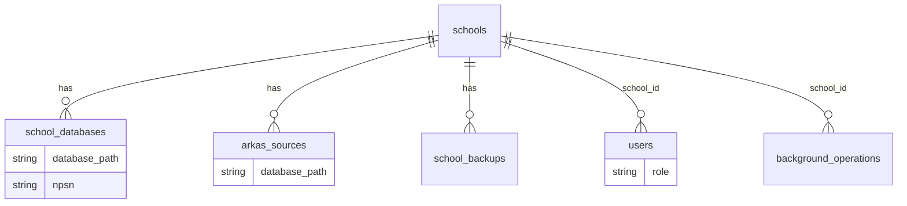
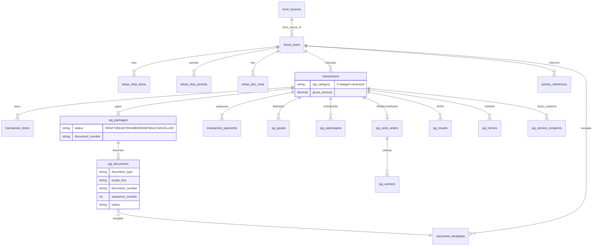

# ARCHITECTURE

Terverifikasi terhadap kode: **2026-09-12**. Detail arsitektur lengkap tetap di `docs/ARCHITECTURE_COMPLETE.md`; berkas ini adalah peta ringkas yang digenerate dari struktur riil.

## Struktur folder (`app/`)

```text
app/
├── Console/Commands/   # 11 command operasional spj:*, arkas:*, employees:*
├── Http/
│   ├── Controllers/    # thin controller: validasi ringan → delegasi UseCase
│   └── Middleware/     # EnsureActiveSchool, EnsureActiveFiscalYear,
│                       # EnsureSpjActiveContext, EnsureAdministrator,
│                       # EnsureOperatorOrAdministrator (+ global MeasureRequestPerformance)
├── Livewire/           # 4 komponen: TransactionsTable, RkasTable,
│                       # RkasBudgetTable, RkasBudgetFilter
├── Models/             # Eloquent central (default) & tenant (connection school)
├── Services/           # ~50 service: sync, numbering, template, identity, audit
├── Support/            # ActiveSpjContext (konteks tenant per-request)
└── UseCases/
    ├── Spj/            # 15 use case domain SPJ (lifecycle, numbering,
    │                   # rollback, settlement, report, workspace, ...)
    └── DocumentTemplates/
```

Lapisan berlaku: **Controller (tipis) → UseCase (orkestrasi domain) → Service (aturan/helper) → Model**. Orchestration besar tidak boleh kembali ke controller. Außnahme yang masih ada dan disengaja: `TransactionController@updateSpjDescriptions`, `SourceReconciliationController@resolve`, `MaintenanceTransactionLinkController` memegang sedikit logika guard + delegasi service.

## Middleware & boundary (terdaftar di `bootstrap/app.php`)

Alias aktual: `active-school`, `active-year`, `administrator`, `operator-or-administrator`, `spj-active-context` (+ `auth`, `throttle`).

```text
request
→ auth (session)
→ active-school      (School via koneksi school; koneksi = isolasi sekolah)
→ active-year        (FiscalYear cocok dengan fund aktif)
→ spj-active-context (route id: transaction/package/document dicek
                      fiscal_year_id + fund_source_id)
→ operator-or-administrator | administrator (peran)
→ controller → UseCase (ActiveSpjContext: matchesTransaction)
```

Boundary tenant canonical di semua layer:

```text
School (koneksi DB) + Fiscal Year (kolom) + Fund Source (kolom)
```

## Alur data utama

### 1. Canonical ARKAS sync

```text
ARKAS database
→ ArkasBridgeClient
→ ArkasStagingService            (staging __years/__profile/__pegawai/...)
→ ArkasReferenceSynchronizationService::synchronizeBase
     (konteks tahun, fund, profil, pegawai/PTK, rekening, periode)
→ ArkasSynchronizationServiceV2::synchronize
     (arkas_rkas_items, arkas_bku_rows, arkas_rkas_periods, transaksi)
→ synchronizeDerived             (activity_references daun, business_partners)
→ reconciliation bila source berubah
```

Entry: `POST /sinkronisasi/arkas` → `ArkasSyncController` → job `SynchronizeArkas`
→ `ArkasCanonicalSyncService::synchronize` (lock `arkas-canonical-sync:{school}:{year}`).
Jalur terpisah dan profile-driven: Generic Importer (`/pengaturan/arkas/importer/*`, lihat `docs/ARKAS_IMPORTER.md`).

### 2. Lifecycle Paket SPJ

```text
transaksi (items + item_description wajib)
→ transactions.prepare-spj     (CreateSpjDraftUseCase → DRAFT)
→ spj.update                   (Isian Manual; READY↔DRAFT bila kategori berubah)
→ spj.ready                    (DRAFT → READY, validasi penuh)
→ spj.quarter-numbering        (READY → NUMBERED, maju TW1→TW4)
→ preview/download             (tanpa side effect numbering)
→ spj.documents.finalize       (→ FINAL, snapshot dikunci)
```

Koreksi: cancel individual (nomor CANCELLED permanen, sequence tidak mundur) vs rollback
(melepas tail untuk dipakai ulang; cancel triwulan mundur TW4→TW1). `spj.unlock`
sengaja dinonaktifkan — selalu error dan mengarahkan ke Koreksi Penomoran.

### 3. Koreksi non-substansi pada NUMBERED

`payment_description` + `item_description` boleh dikoreksi pada `NUMBERED`
(via `PUT spj.update` scope terbatas dan `PUT transaksi/{id}/uraian-spj`);
terkunci penuh pada `FINAL`. Selain dua field itu, NUMBERED hanya berubah via rollback
(lihat `docs/SPJ_DESIGN_DECISIONS.md` §4.2/§4.4).

## ERD ringkas (dari migration riil)

Central (`database/migrations/`, koneksi default):



Tenant sekolah (`database/migrations/school/`, koneksi `school`):



Kolom kunci tambahan (terverifikasi): `transactions` membawa overlay operator
(`payment_description`, `payment_method`, `vendor_*`, `receipt_recipient_name`) di samping
fakta source; `spj_packages` membawa `snapshot`, `finalized_*`, `cancelled_*`, `unlocked_*`;
`spj_documents` membawa `replaces_document_id`, `event_date`, `is_late_entry`.

## Konvensi kode yang mengikat (ringkas; penuh di `AGENTS.md`)

- Controller tipis → UseCase (`app/UseCases/Spj/*`) → Service → Model.
- Setiap baca/tulis tenant memakai `ActiveSpjContext` (`matchesTransaction` = tahun + sumber dana; sekolah via koneksi).
- `SpjPackage::isEditable()` = `DRAFT`/`READY` saja; pengecualian NUMBERED hanya dua field koreksi di atas.
- Setiap mutasi sensitif mencatat `OperationalAuditService`.
- Pint wajib (`vendor/bin/pint --dirty`), test fokus (`php artisan test --compact`), klaim hanya berbasis evidence.
